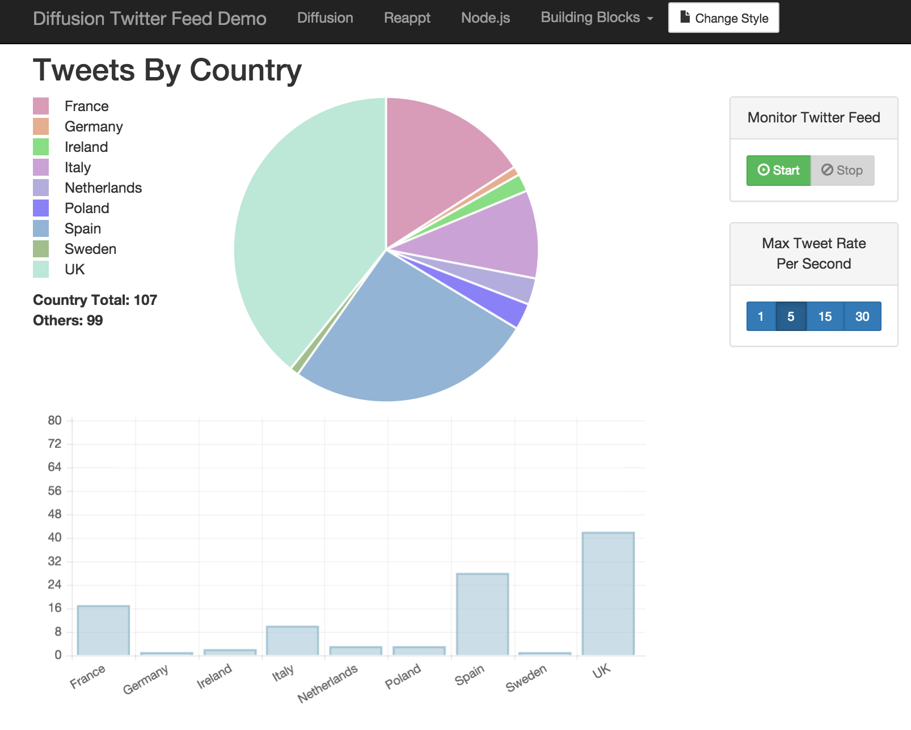

# Diffusion Twitter Feed Demo

This is a basic Twitter Streaming API demo. There are 2 main components :

- server that runs under Node.js. The server process listens to a filtered Twitter stream via the Twitter Streaming API. At periodic intervals it republishes a formatted version of the most recent Tweet to Diffusion.

- HTML5 web client that connects to Diffusion, subscribes to the Twitter stream destination and displays various metrics in the dashboard.


## Running locally

This demo assumes that Diffusion 5.5.2 and Node.js v0.10.25 are already installed. Once they are installed and configured, execute the following steps in order to run the demo locally :


### Clone the repository

Either download the repository as a .zip file or use git...

```Shell
git clone https://github.com/rich-cullen/DiffusionTwitterFeedDemo.git
```


### Run Diffusion

NB. Configuration may be required.


###Configure the Node.js server

The configuration file server/twitterStreamingApiStompBridgeConfig.json must be updated to contain the following:

- your Twitter access tokens and keys. More info on obtaining Twitter access tokens is available [here](https://dev.twitter.com/oauth/overview).

    0. Go to [apps.twitter.com](https://apps.twitter.com/) and create a new app.
    0. Give it a name, such as KaazingTwitterFeedDemo, and fill in the other fields.
    0. Once the application is completed, go to the **Keys and Access Tokens** tab for the application.
    0. Copy the **Consumer Key (API Key)** and **Consumer Secret (API Secret)** fields into the `server/twitterStreamingApiStompBridgeConfig.json` file.
    0. Scroll further down on the **Keys and Access Tokens** page and click the **Create my access token** button.
    0. Put the **Access Token** and **Access Token Secret** into the `server/twitterStreamingApiStompBridgeConfig.json` file.

- connection details for the instance of ActiveMQ being used.


### Start the Node.js server process

Prior to running it, you need install the packages that are depended on. This only needs to be done once, or anytime the package.json file is updated with different dependencies:

```Shell
$ cd server
$ npm install
```
Once the dependencies are installed, you can run it. From within the same server directory:

```Shell
$ npm start
```


### Host the HTML5 web client

A simple way to do this is to run a Python web server from the directory containing index.html

```Shell
python -m SimpleHTTPServer 8090
```

### Start the HTML5 web client

Browse to http://localhost:8090/index.html


### Use the UI

The client should automatically connect to Diffusion and provide visual confirmation that this has been successful. The various controls will also be enabled once connected. Click Start to begin monitoring the live Twitter stream.

## Client Preview

</img>